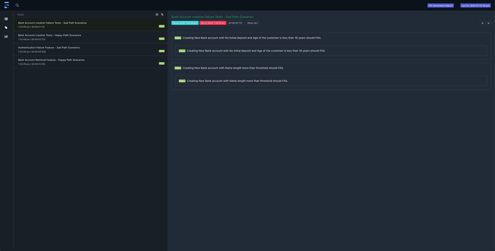
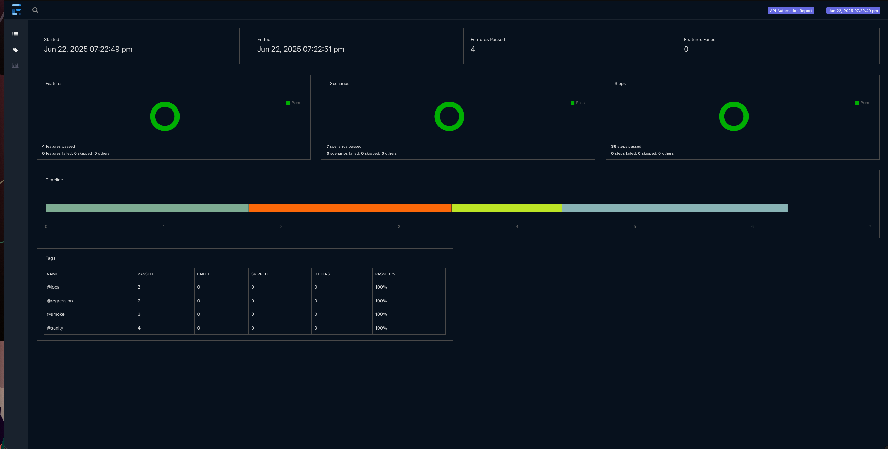
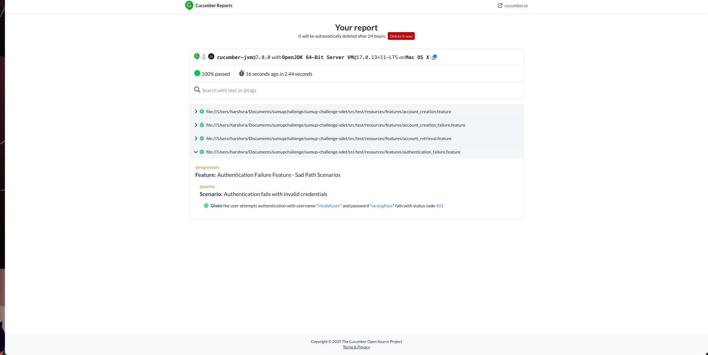
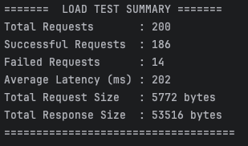

# BDD Cucumber Framework (Developer README)

## 🔧 Requirements

- **IDE**: IntelliJ
- **JDK**: Amazon Corretto 17

## 📦 Recommended IntelliJ Plugins

- Gherkin
- Cucumber for Java
- Maven
- Maven Extension

---

## 📚 Libraries and Plugins Used

| Tool/Library | Purpose |
| ------------ | ------- |
| **Cucumber**        | Behavior-Driven Development (BDD) framework                       |
| **TestNG**          | Test orchestration and suite management                           |
| **REST Assured**    | Simplified REST API testing                                       |
| **Jackson**         | JSON serialization and deserialization                            |
| **SLF4J**           | Logging abstraction layer                                         |
| **Lombok**          | Reduces boilerplate code with annotations (getters/setters, etc.) |
| **Extent Report**   | Advanced and visually rich HTML reporting                         |
| **Surefire Plugin** | Executes tests during Maven build lifecycle                       |

## ✅ Features

### 1. Comprehensive Suite of Automated Tests

- Built using Cucumber BDD and Java
- Tests organized and executed using annotations (`@regression`, `@sanity`, etc.) with Parallelization

### 2. Supported Tooling

- **CI/CD**: GitHub Actions integration
- Trigger test runs via `repository_dispatch` event using GitHub Personal Access Token (PAT)
- Easy integration into CI pipelines

### 3. Reporting

- **Local**: ExtentReport for visually rich HTML test results
  


- **Cloud**: Sharable Cucumber Reports uploaded to Cucumber cloud storage

### 4. Configurable Setup

- Supports multiple environments via `-Denv=local`, `-Denv=staging`, etc.
- Uses `ConfigurationManager.java` to load config files dynamically
- Optional `secret_keys.properties` for sensitive overrides

---

## 🎁 Bonus Features

### 1. Sharable Report Links

- Cloud-hosted Cucumber HTML reports for stakeholders and team members
  

### 2. Retry Analyzer

- Automatically re-runs failed tests twice
- Reduces flakiness in CI/CD pipelines

### 3. Native Load Testing Support

- Flag-based test runner support: `-DloadTesting=true`
- Load-test using randomly generated data with reports logged out as part of terminal

---

## 🔨 Build & Run Commands

### 💡 Build Without Running Tests

```bash
mvn clean install -DskipTests

```


### 🚀 Run Tests by Suite (Tag-Based)

```bash
mvn clean test -Dcucumber.filter.tags="@regression" -Dusername="alice" -Dpassword="s3cr3t" -Denv=staging

mvn clean test -Dcucumber.filter.tags="@sanity" //Default Username and Password used. Envionment set to local
```

### ⚙️ Run Load Tests

```bash
mvn clean test -DloadTesting=true
```

---

## 🧱 Framework Design (For Developers)

### 📂 Project Structure

```
📦 root
├── .github
│   └── workflows
│       └── run-tests.yml
├── pom.xml
├── src
│   ├── main
│   │   └── java
│   │       ├── api
│   │       │   ├── AccountApiClient.java
│   │       │   └── AuthClient.java
│   │       ├── config
│   │       │   └── ConfigurationManager.java
│   │       ├── constant
│   │       │   ├── Constants.java
│   │       │   └── HttpStatusCodes.java
│   │       ├── helper
│   │       │   └── AccountHelper.java
│   │       ├── model
│   │       │   ├── AccountRequestModel.java
│   │       │   └── AuthRequestModel.java
│   │       └── util
│   │           └── TestContext.java
│   └── test
│       ├── java
│       │   ├── loadtest
│       │   │   ├── LoadTestRunner.java
│       │   │   └── TestDataGenerator.java
│       │   ├── runner
│       │   │   └── TestRunner.java
│       │   ├── steps
│       │   │   ├── AccountRetrievalStepDefinitions.java
│       │   │   ├── AccountStepDefinitions.java
│       │   │   ├── AuthStepDefinitions.java
│       │   │   └── Hooks.java
│       │   └── util
│       │       ├── RetryAnalyzer.java
│       │       └── RetryListener.java
│       └── resources
│           ├── features
│           │   ├── account_creation.feature
│           │   ├── account_creation_failure.feature
│           │   ├── account_retrieval.feature
│           │   └── authentication_failure.feature
│           ├── cucumber.properties
│           ├── extent.properties
│           ├── extent-report-config.xml
│           ├── local.properties
│           ├── staging.properties
│           ├── secret_keys.properties
│           └── testng.xml
└── .gitignore    
```
## 🔄 Execution Flow Diagram

User triggers Maven command:
``` mvn clean test -Dcucumber.filter.tags="@regression" -Dusername="alice" -Dpassword="s3cr3t" -Denv=staging ```

```
Maven invokes Surefire plugin to run Tests
        ↓
TestNG runner executes TestRunner.java
        ↓
Cucumber scans for matching feature files and glue code
        ↓
@Before hooks (Hooks.java) are executed
        ↓
AuthStepDefinitions uses AuthClient to generate API key from login API
        ↓
TestContext stores API key
        ↓
Feature: account_creation.feature executes
        ↓
StepDefinitions (AccountStepDefinitions) use AccountApiClient
        ↓
API requests(POST/GET) made using REST Assured
        ↓
Assertions and validations run (using constants & helpers)
        ↓
Results reported to:
   • Console (Pretty format)
   • JSON (target/cucumber.json)
   • HTML via ExtentReports (target/extent-report.html)
```

### 🧪 TestContext

- Thread-safe runtime context storage using `ThreadLocal`
- Used for sharing data (e.g., API key) across steps

### 🔁 Extensibility

- New APIs can be tested by simply adding new client class + request model
- Feature files remain readable, maintainable, and non-technical

---

## 📘 See Also
- [GitHub Actions Workflow Docs](.github/workflows/test.yml)
---

For questions or contributions, please contact the framework maintainer.

---
